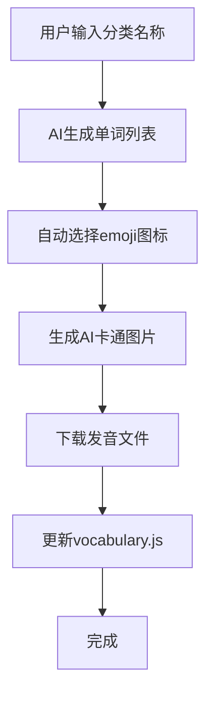

# 添加词汇分类技能设计文档

## 概述

为"看图学英语"应用创建一个开发时使用的技能工具，支持通过简单指令添加新的词汇分类，自动完成单词生成、图片生成、语音下载和数据更新。

## 输入输出

**输入**：分类名称（如"海洋生物"）

**输出**：完整的分类数据已添加到项目中

## 功能流程



## 核心模块

### 1. 单词生成器 (words-generator.js)

**功能**：根据分类名称AI生成相关单词列表

**输入**：分类名称（中文）

**输出**：单词数组 `[{en: 'whale', zh: '鲸鱼'}, ...]`

**逻辑**：
- 调用AI接口生成与分类相关的常见单词
- 智能推荐合适数量（8-15个）
- 检查现有词汇避免重复

### 2. 图片生成器 (image-generator.js)

**功能**：为每个单词生成AI卡通图片

**输入**：单词对象 `{en, zh}`

**输出**：图片文件路径

**逻辑**：
- 调用图片生成API
- 使用白色背景的卡通风格
- 保存为JPG格式到 `public/images/`

### 3. 语音下载器 (audio-downloader.js)

**功能**：下载单词发音文件

**输入**：英文单词

**输出**：音频文件路径

**逻辑**：
- 优先使用有道词典API
- 失败时使用dictionaryapi.dev备用
- 保存为MP3格式到 `public/audio/`

### 4. 数据更新器 (data-updater.js)

**功能**：更新vocabulary.js数据文件

**输入**：分类信息、单词列表

**输出**：更新后的vocabulary.js

**逻辑**：
- 读取现有vocabulary.js
- 添加新分类到数据对象
- 保持代码格式一致

## 文件结构

```
scripts/
├── add-category.js         # 技能入口
└── lib/
    ├── words-generator.js  # 单词生成
    ├── image-generator.js  # 图片生成
    ├── audio-downloader.js # 语音下载
    └── data-updater.js     # 数据更新
```

## 使用示例

```
用户：增加海洋生物
技能：正在为"海洋生物"生成内容...
      ✅ 生成单词：whale, dolphin, shark, octopus, jellyfish, seahorse, crab, lobster, starfish, turtle
      ✅ 生成图片：10张
      ✅ 下载语音：10个
      ✅ 更新数据文件
      完成！
```

## 技术依赖

- Node.js
- AI文本生成接口（用于单词生成）
- 图片生成API：`https://trae-api-cn.mchost.guru/api/ide/v1/text_to_image`
- 语音API：`http://dict.youdao.com/dictvoice?audio={word}&type=2`

## 增量更新逻辑

如果分类已存在部分单词：
1. 读取现有单词列表
2. AI生成新单词时排除已有单词
3. 只生成和下载新增单词的资源
4. 合并到现有单词列表中
